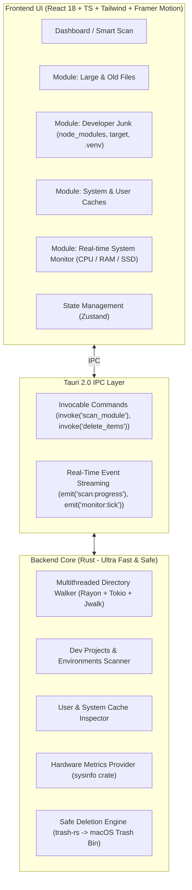

# 🧹 AuroraClean — Architecture & Project Plan

> **Personal CleanMyMac Alternative for macOS**  
> High-performance, memory-efficient desktop utility built with **Tauri v2**, **Rust**, and **React + TypeScript**.

---

## 🎯 Project Overview & Objectives
AuroraClean is a modern, lightweight desktop application designed to detect heavy files, system junk, and developer caches, offering safe and intelligent cleanup recommendations.

- **Primary Platform:** macOS (Apple Silicon & Intel).
- **Core Motivation:** Personal tool + practical deep dive into **Rust / Systems Architecture** and modern desktop engineering with **Tauri**.
- **Aesthetic Goal:** Modern macOS Glassmorphism (dark mode, translucent blurred panels, subtle aurora glow effects, fluid 60fps animations).

---

## 🏗️ System Architecture



---

## 🛠️ Technology Stack

| Layer | Technology | Key Libraries / Crates | Rationale |
| :--- | :--- | :--- | :--- |
| **Backend / Core Engine** | **Rust (Latest Stable)** | `tauri v2`, `tokio`, `rayon`, `jwalk`, `sysinfo`, `trash`, `serde`, `serde_json` | Native filesystem traversal speed, safety, multithreading without data races, and ultra-low RAM footprint. |
| **Desktop Framework** | **Tauri 2.0** | `@tauri-apps/api`, `@tauri-apps/plugin-shell` | Uses WebKit natively on macOS (no bundled Chromium bloat like Electron), tiny binary size (< 15MB). |
| **Frontend Framework** | **React 18 + TypeScript** | `vite`, `zustand`, `lucide-react`, `framer-motion`, `clsx`, `tailwind-merge` | Robust component ecosystem, type safety matching Rust models, rich animation support. |
| **Styling & Design System** | **TailwindCSS + Custom Glassmorphism** | Vanilla CSS tokens + Backdrop filters | macOS dark aesthetics, vibrant accents, sleek borders and micro-interactions. |

---

## 📦 Functional Modules (MVP)

### 1. ⚡ Smart Scan (One-Click Dashboard)
- Unified diagnostic that runs an optimized scan across:
  - System caches (`~/Library/Caches`, `/Library/Logs`).
  - Active developer builds (`node_modules`, `target/`, `.venv`).
  - Heavy unaccessed files in `~/Downloads` and user directories.
- Displays an interactive circular orbital progress ring with live gigabyte recovery estimates.

### 2. 🗄️ Large & Old Files
- **Configurable Filters:**
  - **Size thresholds:** `> 100 MB`, `> 500 MB`, `> 1 GB`, `> 5 GB`.
  - **Age criteria:** `> 1 month`, `> 6 months`, `> 1 year` (via file metadata `atime`/`mtime`).
  - **Categories:** Disk Images (`.dmg`, `.pkg`, `.iso`), Archives (`.zip`, `.tar.gz`, `.rar`), Media (`.mp4`, `.mov`, `.mkv`), Documents.
- Interactive list with checkboxes, file sorting, and quick "Reveal in Finder" action.

### 3. 💻 Developer Junk
- **Python:** `.venv`, `venv`, `__pycache__`, `.pytest_cache`, `.ipynb_checkpoints`, `~/.cache/pip`.
- **Rust / C++:** Cargo `target/` directories, CMake build artifacts, `~/.cargo/registry/cache`.
- **Node.js / Web:** `node_modules` (with last modified project tracking), `.npm`, `.pnpm-store`, `.yarn/cache`.
- **Xcode / macOS:** `DerivedData`, CoreSimulator device caches, orphaned Archives.
- **Docker:** Detection of dangling images and build caches.

### 4. 🧹 System & User Caches
- Safe user cache scanning: `~/Library/Caches/*`.
- macOS User Logs (`~/Library/Logs`).
- System Trash status & quick purge (`~/.Trash`).

### 5. 📊 Live System Resource Monitor
- Background ticker in Rust (`sysinfo`) streaming updates every 1-2 seconds:
  - **RAM Usage:** Total, Active, Inactive, Compressed / Swap memory.
  - **CPU Utilization:** Per-core and total percentage with smooth sparkline chart.
  - **Disk Storage:** Visual bar breakdown (Used, System, Free).

---

## 🛡️ Safety & Permission Architecture

1. **Default Safe Deletion (macOS Trash):**
   - All delete actions use the macOS native `trash` crate (`trash::delete_all(...)`). Items go directly to `~/.Trash`, allowing full user undo/recovery.
2. **Explicit Permanent Delete Option:**
   - Permanent deletion (`std::fs::remove_dir_all` / `remove_file`) is available only via an intentional opt-in switch with confirmation dialogs.
3. **Hardcoded Safelist:**
   - Critical system and user roots are protected in Rust: `/System`, `/usr`, `/bin`, `/Applications`, `/Library/Preferences`, `/etc`, and root iCloud documents.
4. **Pre-Deletion Summary Modal:**
   - Always shows the exact list of selected items, item count, and precise bytes to be reclaimed before performing any destructive operation.

---

## 📁 Repository Directory Structure Blueprint

```text
aurora-clean/
├── README.md                  # Project overview for GitHub / users
├── GEMINI.md                  # Assistant guidelines & developer profile
├── docs/
│   └── PROJECT_PLAN.md        # Master architecture and roadmap document
├── src-tauri/                 # Backend Rust Core
│   ├── Cargo.toml             # Rust dependencies & metadata
│   ├── tauri.conf.json        # Tauri window setup, permissions & capabilities
│   └── src/
│       ├── main.rs            # Application entry point
│       ├── lib.rs             # Tauri command registrations & plugins
│       ├── models.rs          # Shared data structs (ScannedItem, ScanProgress, SystemStats)
│       ├── scanner/           # Multithreaded scanning engine
│       │   ├── mod.rs
│       │   ├── file_walker.rs # Rayon / Jwalk directory traverser
│       │   └── filters.rs     # Age, size & extension evaluation
│       ├── modules/           # Domain-specific scan engines
│       │   ├── mod.rs
│       │   ├── dev_junk.rs    # node_modules, target, .venv scanner
│       │   ├── caches.rs      # ~/Library/Caches scanner
│       │   └── large_files.rs # Heavy asset inspector
│       ├── cleaner/           # Safe deletion engine
│       │   ├── mod.rs
│       │   ├── trash_ops.rs   # macOS trash integration
│       │   └── safelist.rs    # Protected directories guard
│       └── monitor/           # Hardware statistics engine
│           ├── mod.rs
│           └── sys_stats.rs   # sysinfo memory & CPU worker
│
├── src/                       # Frontend Web UI (React + TS - managed by agent)
│   ├── index.html             # HTML5 template
│   ├── package.json           # Frontend dependencies & scripts
│   ├── vite.config.ts         # Vite bundler configuration
│   ├── tailwind.config.js     # Glassmorphism utilities & theme tokens
│   ├── tsconfig.json          # TypeScript strict configuration
│   └── src/
│       ├── App.tsx            # Root component with layout & navigation
│       ├── index.css          # CSS reset, glassmorphism tokens, keyframe animations
│       ├── types/             # TypeScript models matching Rust structs
│       │   └── index.ts
│       ├── hooks/             # Custom React hooks (useTauriScan, useSystemMonitor)
│       ├── store/             # Zustand store for scan state & selection
│       ├── components/
│       │   ├── layout/        # Sidebar, Header, WindowTitlebar
│       │   ├── smart-scan/    # 1-Click Scan view with orbital visualizer
│       │   ├── large-files/   # Large & Old files view with table & filters
│       │   ├── dev-junk/      # Developer Junk view with project badges
│       │   ├── system-caches/ # Caches & logs management view
│       │   ├── monitor/       # Hardware telemetry widgets (RAM, CPU, SSD)
│       │   └── common/        # Modal, Button, Checkbox, Badge, ProgressRing, StatCard
└── .gitignore
```

---

## 🧠 Pedagogical & Rust Learning Workflow

To ensure a solid foundation in **Rust from scratch** and mastery of systems architecture:
1. **Incremental Step-by-Step Guidance:** No abrupt or automated bulk modifications to the Rust backend. Each file and module will be developed incrementally.
2. **Conceptual Foundations First:** Before writing code, key Rust paradigms (*ownership*, *borrowing*, *lifetimes*, *Result/Option*, multithreading with `Rayon`/`Tokio`, ecosystem crates) will be explained with analogies to Python/C++ where applicable.
3. **Copy-Ready, Complete Code Blocks:** Full, strongly-typed, and functional code snippets will be provided for the developer to inspect, copy, paste into files, and execute manually.
4. **Compiler-Driven Learning:** Guidance will be provided on reading and understanding `rustc` and `cargo check` compiler diagnostics to master memory safety principles.

---

## 🚦 Execution Roadmap & Status Tracking

For real-time progress, completed milestones, and upcoming tasks, see [STATUS.md](./STATUS.md).
